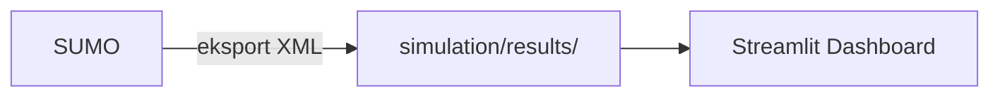

# GreenFlow

**Inteligentny system optymalizacji ruchu drogowego z wykorzystaniem uczenia ze wzmocnieniem (Reinforcement Learning, RL)**

GreenFlow to projekt wykorzystujący sztuczną inteligencję do optymalizacji sterowania sygnalizacją świetlną. System uczy się na podstawie symulacji ruchu drogowego, jak najlepiej sterować światłami, aby zminimalizować czas oczekiwania pojazdów na skrzyżowaniach.

[Link do prezentacji]

---

## O projekcie

### Problem

Korki i zatory drogowe to poważny problem współczesnych miast. Tradycyjne systemy sygnalizacji świetlnej działają według sztywnych harmonogramów.
GreenFlow wykorzystuje **Reinforcement Learning** do trenowania agenta AI, który uczy się optymalnego sterowania sygnalizacją świetlną.
Agent:
- Obserwuje aktualny stan ruchu (liczba pojazdów, czas oczekiwania)
- Podejmuje decyzje o zmianie świateł
- Otrzymuje nagrodę za zmniejszenie czasu oczekiwania pojazdów
- Z czasem uczy się coraz lepszych strategii

**Lokalizacja:** Symulacja bazuje na rzeczywistej sieci drogowej **Gdańska** (okolice Galerii Bałtyckiej) z OpenStreetMap.

---

## Funkcjonalności

- Realistyczna symulacja ruchu drogowego w SUMO
- 7 typów pojazdów z różnymi charakterystykami:
  | Typ | Opis |
  |-----|------|
  | `car` | Samochody osobowe |
  | `car_ev` | Pojazdy elektryczne |
  | `motorcycle` | Motocykle |
  | `truck` | Ciężarówki |
  | `bus` | Autobusy komunikacji miejskiej |
  | `tram` | Tramwaje gdańskie |
  | `emergency` | Pojazdy uprzywilejowane (karetki, straż) |

- 23 pętle indukcyjne (detektory ruchu) monitorujące natężenie ruchu
- 6 przystanków autobusowych przy Galerii Bałtyckiej
- Agent PPO (Proximal Policy Optimization) do uczenia sterowania
- Śledzenie emisji spalin pojazdów
- **Dashboard Streamlit** — analiza i porównanie wyników symulacji (przejazdy, emisje, czas oczekiwania) na podstawie plików XML z SUMO

---

## Architektura systemu

### Przepływ danych (trening RL)

1. **Środowisko SUMO** symuluje ruch drogowy
2. **Agent** obserwuje stan skrzyżowania (kolejki, czas oczekiwania)
3. **Agent** wybiera akcję (zmiana fazy świateł)
4. **Środowisko SUMO** wykonuje akcję i zwraca nagrodę
5. **Agent** uczy się na podstawie nagrody

### Analiza wyników (offline)

Po zakończeniu symulacji SUMO zapisuje m.in. `tripinfos.xml`, `stats.xml`, `stopinfos.xml` w folderze eksperymentu (`simulation/results/<nazwa>/`). Dashboard Streamlit wczytuje te pliki w trybie tylko do odczytu.



---

## Oprogramowanie

| Wymaganie | Wersja |
|-----------|--------|
| Python | 3.10+ |
| SUMO | 1.26.0 |
| pip | najnowsza |

---

## Instalacja

### 1. Zainstaluj SUMO

```bash
# macOS
brew install sumo

# Ubuntu/Debian
sudo add-apt-repository ppa:sumo/stable
sudo apt-get update && sudo apt-get install sumo sumo-tools sumo-doc

# Windows: https://sumo.dlr.de/docs/Downloads.php
```

### 2. Ustaw SUMO_HOME

```bash
# macOS (Homebrew)
export SUMO_HOME="/opt/homebrew/opt/sumo/share/sumo"

# Linux
export SUMO_HOME="/usr/share/sumo"
```

### 3. Setup projektu

```bash
git clone <URL-repozytorium>
cd GreenFlow
python3 -m venv venv
source venv/bin/activate  # Windows: venv\Scripts\activate
pip install -r requirements.txt              # RL / SUMO
pip install -r dashboard/requirements.txt    # Streamlit dashboard
```

---

## Struktura projektu

```
GreenFlow/
│
├── scripts/
│   └── rl-simulation.py          # Główny skrypt trenowania agenta
│
├── simulation/
│   ├── network/                   # Sieć drogowa Gdańska (OSM)
│   │   ├── osm.net.xml           # Sieć (wygenerowana z OSM)
│   │   └── ...                   # Konfiguracje netedit, poly, edge-types
│   │
│   ├── demand/                    # Definicje popytu i tras pojazdów
│   │   ├── *.rou.xml             # Trasy (car, bus, tram, truck, …)
│   │   └── vtypes.add.xml       # Definicje typów pojazdów
│   │
│   ├── additionals/               # Przystanki, widoki, dodatkowe pliki
│   │   ├── osm_stops.add.xml
│   │   ├── osm.add.xml
│   │   └── osm.view.xml
│   │
│   ├── results/                   # Wyniki eksperymentów (generowane)
│   │   └── <eksperyment>/        # Podfolder per eksperyment
│   │       ├── tripinfos.xml     # Informacje o przejazdach
│   │       ├── stats.xml         # Statystyki symulacji
│   │       ├── stopinfos.xml     # Informacje o zatrzymaniach
│   │       └── emissions.xml     # Emisje spalin
│   │
│   ├── osm.sumocfg               # Konfiguracja symulacji SUMO
│   ├── osm.add.xml               # Detektory i przystanki
│   ├── build.bat                  # Budowanie sieci (Windows)
│   ├── run.bat                    # Uruchomienie symulacji (Windows)
│   └── generate_routes.bat       # Generowanie tras (Windows)
│
├── dashboard/                     # Streamlit — analiza wyników
│   ├── app.py                    # Punkt wejścia dashboardu
│   ├── data_loader.py            # Ładowanie i parsowanie XML
│   ├── components/               # Widoki / zakładki
│   │   ├── overview.py
│   │   ├── comparison.py
│   │   ├── emissions.py
│   │   └── temporal.py
│   └── requirements.txt          # Zależności dashboardu
│
├── models/                        # Wytrenowane modele (generowane lokalnie,
│   ├── best_model/               #   katalog w .gitignore — nie wersjonowany)
│   └── ppo_traffic_tensorboard/  # Logi TensorBoard
│
├── requirements.txt               # Zależności Python (RL / SUMO)
├── .gitignore
└── README.md
```

---

## Uruchomienie

```bash
# Training
cd scripts && python rl-simulation.py

# TensorBoard monitoring
tensorboard --logdir=models/ppo_traffic_tensorboard
# http://localhost:6006

# Symulacja bez AI (GUI)
cd simulation && sumo-gui -c osm.sumocfg

# Dashboard (analiza wyników)
cd dashboard && streamlit run app.py
```

> Dashboard wymaga co najmniej jednego eksperymentu w `simulation/results/` zawierającego plik `tripinfos.xml`.

---

## Stack technologiczny

| Warstwa | Technologia | Zastosowanie |
|---------|-------------|--------------|
| Symulacja | SUMO 1.26.0 | Mikroskopowa symulacja ruchu |
| RL Framework | Stable Baselines 3 | Implementacja algorytmu PPO |
| Deep Learning | PyTorch 2.10.0 | Sieci neuronowe dla agenta |
| Most SUMO-RL | sumo-rl | Integracja SUMO z Gymnasium |
| Dashboard | Streamlit, Plotly | Wizualizacja wyników symulacji |
| Monitorowanie | TensorBoard | Wizualizacja postępu trenowania |
| Przetwarzanie danych | Pandas, NumPy | Analiza danych |

### Algorytm PPO

Agent wykorzystuje algorytm **Proximal Policy Optimization (PPO)** z następującymi parametrami:

| Parametr | Wartość | Opis |
|----------|---------|------|
| Learning rate | 0.001 | Szybkość uczenia |
| Gamma | 0.99 | Współczynnik dyskontowania |
| Batch size | 128 | Rozmiar partii |
| Architektura sieci | [256, 128, 64] | Warstwy ukryte |
| Funkcja nagrody | diff-waiting-time | Różnica czasu oczekiwania |

---

## Autorzy

Kacper Brajecki, Remigiusz Świątkowski, Patryk Sowiński.

---

## Źródła i dokumentacja

- [Dokumentacja SUMO](https://sumo.dlr.de/docs/)
- [Dokumentacja sumo-rl](https://lucasalegre.github.io/sumo-rl/)
- [Stable Baselines 3](https://stable-baselines3.readthedocs.io/)
- [PPO Paper](https://arxiv.org/abs/1707.06347)
